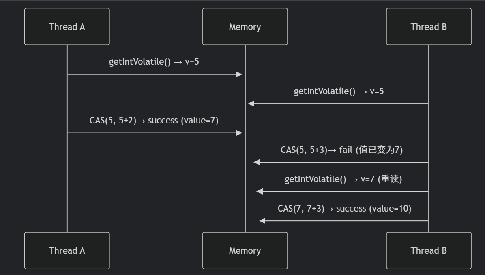

## 锁

###  CAS（Compare and Swap）
CAS（Compare-And-Swap）操作确保在多线程环境下安全地更新值

~~~java
public final int getAndAddInt(Object o, long offset, int delta) {
    int v;
    do {
        v = getIntVolatile(o, offset);
    } while (!compareAndSwapInt(o, offset, v, v + delta));
    return v;
}
~~~

sequenceDiagram
Thread A->>+Memory: getIntVolatile() → v=5
Thread B->>+Memory: getIntVolatile() → v=5
Thread A->>+Memory: CAS(5, 5+2)→ success (value=7)
Thread B->>+Memory: CAS(5, 5+3)→ fail (值已变为7)
Thread B->>+Memory: getIntVolatile() → v=7 (重读)
Thread B->>+Memory: CAS(7, 7+3)→ success (value=10)

